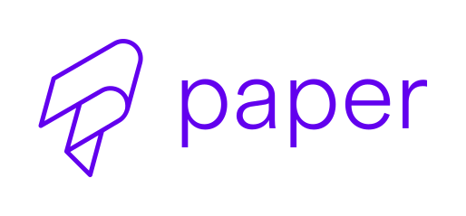

<p align="center">
  
  
</p>
<p align="center">
  <a href="https://github.com/callstack/react-native-paper">React-native-paper</a> for ReasonML.
</p>

---

[![Build Status][build-badge]][build]
[![Version][version-badge]][package]
[![MIT License][license-badge]][license]
[![PRs Welcome][prs-welcome-badge]][prs-welcome]
[![Chat][chat-badge]][chat]

# bs-react-native-paper

## Installation

Use yarn or npm

```
$ yarn add bs-react-native-paper react-native-paper
```

Then add `bs-react-native-paper` to `bsconfig.json`

```json
"bs-dependencies": ["bs-react-native-paper"]
```

## Example usage

### Using theme

```ocaml
/* We provide a helper function called `createTheme` that defaults with DefaultTheme */
let theme =
  Paper.ThemeProvider.(
    createTheme(
      ~colors=
        themeColors(
          ~primary="#6200EE",
          ~accent="#03dac4",
          ~background="#f6f6f6",
          ~surface="white",
          ~error="#B00020",
          ~text="black",
          ~disabled="rgba(0, 0, 0, 0.26)",
          ~placeholder="rgba(0, 0, 0, 0.54)",
          ~backdrop="rgba(0, 0, 0, 0.5)",
        ),
      (),
    )
  );

let component = ReasonReact.statelessComponent("AppTheme");

let make = children => {
  ...component,
  render: _self =>
    <Paper.ThemeProvider theme>
      (ReasonReact.array(children))
    </Paper.ThemeProvider>,
};
```

### Using components

```ocaml
<Paper.Button mode=`contained onPress={_event => self.send(YourAction)}>
  <Paper.Text>
    {ReasonReact.string("Click me")}
  </Paper.Text>
</Paper.Button>
```

```ocaml
<Paper.FABGroup
  actions=Paper.FABGroup.[|
    fabAction(~icon=Icon.Name("add"), ~onPress=() => Js.log("add"), ()),
    fabAction(~icon=Icon.Name("star"), ~onPress=() => Js.log("start"), ()),
    fabAction(~icon=Icon.Name("notifications"),  ~onPress=() => Js.log("notifications"), ()),
  |]
  onStateChange
  icon={
    Icon.Element(
      Icon.renderIcon((props: Icon.iconProps) =>
        <RNIcons.MaterialIcons
          name=`_add
          size={props.size}
        />
      ),
    )
  }
/>
```

## Try it out

Run the [example app](https://expo.io/@trensik/bs-react-native-paper-example) with [Expo](https://expo.io/) to see it in action.

The source code for the examples are under the [/example](/example) folder.

## Documentation

We do not have dedicated documentation for this library, but you can check example usage of components in our example app. It is located in /example directory. Components' api in most cases is very similar or the same as in [react-native-paper](https://github.com/callstack/react-native-paper), but there are cases where we had to implement props differently, so if you encounter problems I would suggest to check the source code of particular binding.

## Contributing

Read the [contribution guidelines](/CONTRIBUTING.md) before contributing.

<!-- badges -->

[build-badge]: https://img.shields.io/circleci/project/github/callstackincubator/bs-react-native-paper/master.svg?style=flat-square
[build]: https://circleci.com/gh/callstackincubator/bs-react-native-paper
[version-badge]: https://img.shields.io/npm/v/bs-react-native-paper.svg?style=flat-square
[package]: https://www.npmjs.com/package/bs-react-native-paper
[license-badge]: https://img.shields.io/npm/l/bs-react-native-paper.svg?style=flat-square
[license]: https://opensource.org/licenses/MIT
[prs-welcome-badge]: https://img.shields.io/badge/PRs-welcome-brightgreen.svg?style=flat-square
[prs-welcome]: http://makeapullrequest.com
[chat-badge]: https://img.shields.io/discord/426714625279524876.svg?style=flat-square&colorB=758ED3
[chat]: https://discord.gg/zwR2Cdh
